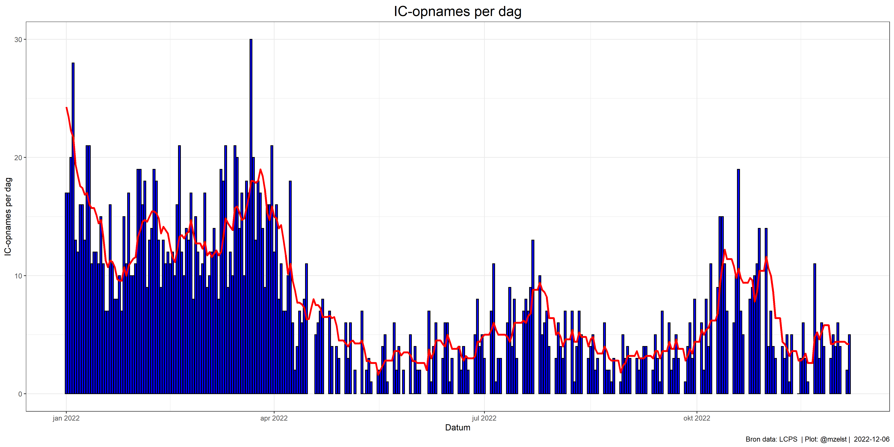

---
authors:
- admin
categories:
- covid-19
date: "2022-12-07T00:00:00Z"
draft: false
featured: false
image:
  caption: 'Image credit: [**Unsplash**](https://unsplash.com/photos/CpkOjOcXdUY)'
  focal_point: ""
  placement: 2
  preview_only: false
lastmod: "2022-12-07T00:00:00Z"
projects: []
subtitle: "Hier vind je elke dag de laatste cijfers over covid-19 in Nederland, met o.a. de stand van zaken in het ziekenhuis en cijfers over covid-19 in het rioolwater of de Infectieradar."
summary: "Hier vind je elke dag de laatste cijfers over covid-19 in Nederland, met o.a. de stand van zaken in het ziekenhuis en cijfers over covid-19 in het rioolwater of de Infectieradar."
tags:
- covid-19
title: Dagelijkse statistieken over covid-19
---

## Overview

 

1. The Wowchemy website builder for Hugo, along with its starter templates, is designed for professional creators, educators, and teams/organizations - although it can be used to create any kind of site
2. The template can be modified and customised to suit your needs. It's a good platform for anyone looking to take control of their data and online identity whilst having the convenience to start off with a **no-code solution (write in Markdown and customize with YAML parameters)** and having **flexibility to later add even deeper personalization with HTML and CSS**
3. You can work with all your favourite tools and apps with hundreds of plugins and integrations to speed up your workflows, interact with your readers, and much more

## Links

- 👉 [**Create a new site**](https://wowchemy.com/templates/)
- 📚 [**Personalize your site**](https://wowchemy.com/docs/)
- 💬 [Chat with the **Wowchemy community**](https://discord.gg/z8wNYzb) or [**Hugo community**](https://discourse.gohugo.io)
- 🐦 Twitter: [@wowchemy](https://twitter.com/wowchemy) [@GeorgeCushen](https://twitter.com/GeorgeCushen) [#MadeWithWowchemy](https://twitter.com/search?q=%23MadeWithWowchemy&src=typed_query)
- 💡 [Request a **feature** or report a **bug** for _Wowchemy_](https://github.com/wowchemy/wowchemy-hugo-themes/issues)
- ⬆️ **Updating Wowchemy?** View the [Update Tutorial](https://wowchemy.com/docs/hugo-tutorials/update/) and [Release Notes](https://wowchemy.com/updates/)

## Features

- **Page builder** - Create _anything_ with [**widgets**](https://wowchemy.com/docs/page-builder/) and [**elements**](https://wowchemy.com/docs/content/writing-markdown-latex/)
- **Edit any type of content** - Blog posts, publications, talks, slides, projects, and more!
- **Create content** in [**Markdown**](https://wowchemy.com/docs/content/writing-markdown-latex/), [**Jupyter**](https://wowchemy.com/docs/import/jupyter/), or [**RStudio**](https://wowchemy.com/docs/install-locally/)
- **Plugin System** - Fully customizable [**color** and **font themes**](https://wowchemy.com/docs/customization/)
- **Display Code and Math** - Code highlighting and [LaTeX math](https://en.wikibooks.org/wiki/LaTeX/Mathematics) supported
- **Integrations** - [Google Analytics](https://analytics.google.com), [Disqus commenting](https://disqus.com), Maps, Contact Forms, and more!
- **Beautiful Site** - Simple and refreshing one page design
- **Industry-Leading SEO** - Help get your website found on search engines and social media
- **Media Galleries** - Display your images and videos with captions in a customizable gallery
- **Mobile Friendly** - Look amazing on every screen with a mobile friendly version of your site
- **Multi-language** - 34+ language packs including English, 中文, and Português
- **Multi-user** - Each author gets their own profile page
- **Privacy Pack** - Assists with GDPR
- **Stand Out** - Bring your site to life with animation, parallax backgrounds, and scroll effects
- **One-Click Deployment** - No servers. No databases. Only files.
